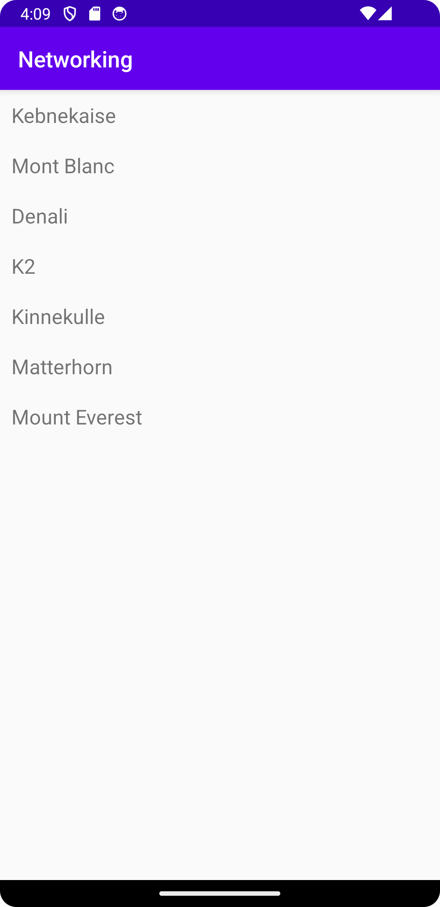

# Rapport

## Följande grundsyn gäller dugga-svar:

- Jag la till en RecyclerView till activity_main
- Jag skapade en RecyclerViewItem class som endast innehåller titel som variabel med en getter och setter
- Jag skapade en Mountain class samt la till en arraylist med Mountain, och recycler view adapter som member variable i main activity
```
    private RecyclerViewAdapter adapter;
    private ArrayList<Mountain> mountains;
```
- I MainActivity lade jag till några mountains, konverterade dem och la till dem i items listan
```
        mountains = new ArrayList<>(Arrays.asList(
                new Mountain("Kebnekaise"),
                new Mountain("Mont Blanc"),
                new Mountain("Denali")

        ));

        items = new ArrayList<>();
        for (Mountain mountain : mountains){
            items.add(new RecyclerViewItem(mountain.getName()));

        }
```
- Jag skapade en RecyclerView.Adapter och en RecyclerView.Holder i en ny class RecyclerViewAdapter med hjälp av koden på dugga
- Jag ändrade JSON URL:en till rätt address
- Jag skapade en ny JSON task för att hämta filen
```
        new JsonTask(this).execute(JSON_URL);     
```
- Jag skrev kod för att parse:a JSON stringen samt lägga till listan till den existerande items listan
- Jag notifierade sedan adaptern så att den kunde uppdatera Viewen
```
    public void onPostExecute(String json) {
        Log.d("MainActivity", json);

        Gson gson = new Gson();

        Type type = new TypeToken<List<Mountain>>() {}.getType();
        List<Mountain> listOfMountains = gson.fromJson(json, type);
        for(Mountain mountain : listOfMountains){
            items.add(new RecyclerViewItem(mountain.getName()));
        }
        adapter.notifyDataSetChanged();
    }
```

- Nedan är bild på skärmen 




